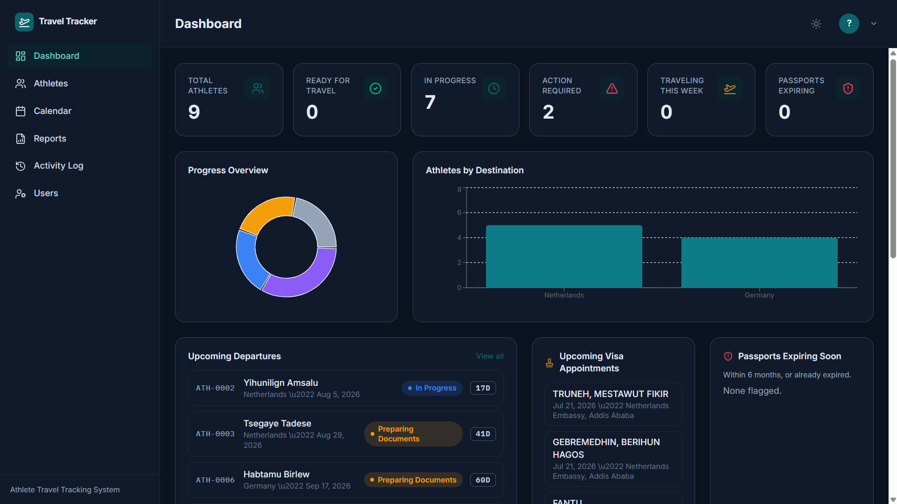
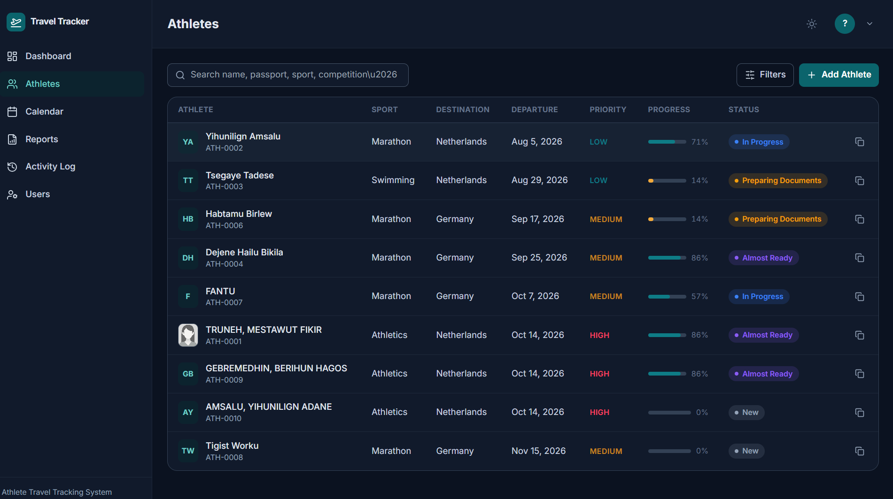

# Travel Management System

A full-stack web application for managing traveler records, trip documentation, and travel-related administrative workflows — built for organizations that need to track passports, visas, appointments, and traveler profiles in one place.



## Overview

This system centralizes traveler information and travel document management, replacing manual spreadsheets and scattered records with a single source of truth. It's designed for organizations that regularly coordinate travel for groups of people — teams, delegations, staff, or members — and need visibility into who's traveling, document status, and upcoming deadlines.

## Features

- **Traveler profiles** — centralized records with photo, contact details, and travel history
- **Passport & visa tracking** — monitor expiration dates and get ahead of renewals before they become a problem
- **Automated reminders** — background jobs flag upcoming visa/passport expirations and appointment deadlines
- **Appointment scheduling** — track appointment times with batch notification support
- **User & role management** — manage system users with appropriate access levels
- **Dashboard** — at-a-glance overview of key metrics, upcoming deadlines, and traveler status
- **Document/photo uploads** — attach and manage supporting documents per traveler record

## Tech Stack

**Client**
- React (Vite)
- Tailwind CSS
- ESLint

**Server**
- Node.js
- REST API architecture (modular controllers/services/routes)
- SQL database with migration-based schema management
- Background job scheduling (reminder notifications)

## Project Structure

```
travel-tracker/
├── client/               # React frontend
│   ├── src/
│   │   ├── components/
│   │   ├── features/
│   │   ├── pages/
│   │   ├── hooks/
│   │   └── lib/
│   └── ...
├── server/               # Node.js backend
│   ├── src/
│   │   ├── modules/      # feature modules (traveler records, users, dashboard, etc.)
│   │   ├── jobs/         # scheduled/background jobs
│   │   ├── middleware/
│   │   └── db/migrations/
│   └── ...
├── CODING_STANDARDS.md
└── README.md
```

## Getting Started

### Prerequisites

- Node.js (v18 or higher recommended)
- npm
- A running database instance (see server `.env.example` for connection variables)

### Installation

Clone the repository:

```bash
git clone https://github.com/dereje677e8/travel-tracker.git
cd travel-tracker
```

**Server setup**

```bash
cd server
npm install
cp .env.example .env   # fill in your database and config values
npm run dev
```

**Client setup**

```bash
cd client
npm install
cp .env.example .env   # point to your running server API
npm run dev
```

The client will be available at `http://localhost:5173` (default Vite port) and the server API at the port configured in your `.env`.

### Running database migrations

```bash
cd server
# run your project's migration command here, e.g.:
npm run migrate
```

## Screenshots

| Dashboard | Traveler Records |
|---|---|
|  |  |

| Traveler Detail | Appointment Scheduling |
|---|---|
|  |  |

## Coding Standards

This project follows a documented set of coding conventions — see [`CODING_STANDARDS.md`](CODING_STANDARDS.md) for details on code style, structure, and contribution guidelines.

## Roadmap / Possible Extensions

- Multi-organization / multi-tenant support
- Export reports (PDF/CSV) for traveler and document status
- Role-based permission granularity
- Mobile-responsive check-in workflow

## License

This project is licensed under the MIT License — see the [LICENSE](LICENSE) file for details.

## Author

**Dereje Sichala**
Senior Cloud & DevOps Engineer
[LinkedIn](#) · [Portfolio](#)
